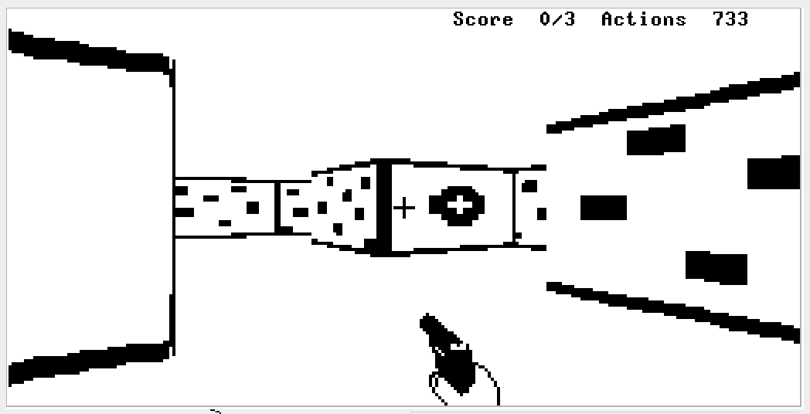
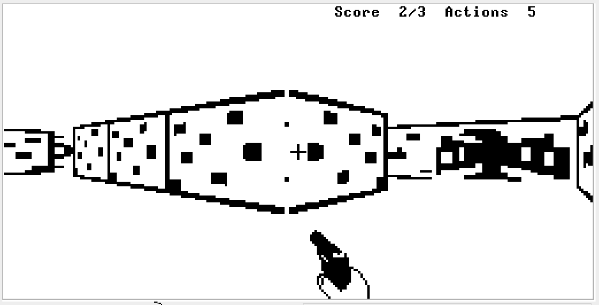
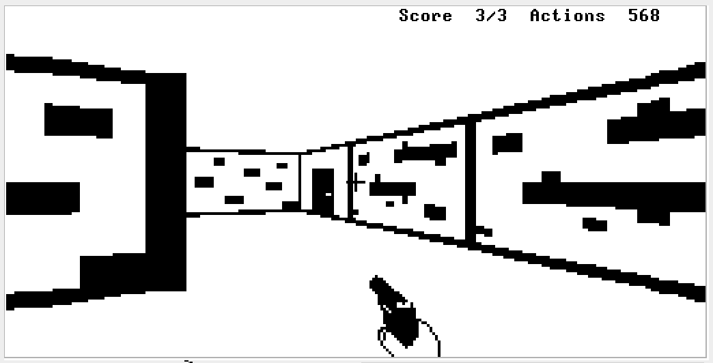

HACKENSTEIN 3D - Escape from Castle Hackenstein, Part II
--------------------------------------------------------

ABOUT

Hackenstein 3D is a (very) simple first-person shooter /
3D maze game. It is an attempt to recreate the experience 
of Castle Wolfenstein on the Hack computer, whose many
limitations have necessitated several compromises. 
There are no Nazis, for a start!

I have posted a short demo video of the game on [youTube](https://youtu.be/inFJ5EyOhpM).

OBJECT OF THE GAME

The object of the game is to destroy all of the targets painted on the
walls and escape the castle before time runs out.

GAME PLAYING INSTRUCTIONS

Use the Arrow Keys to move around. 
Press Space Bar to shoot.
To quit the game, press Q.

To win the game, you need to:
* shoot all three targets

* use the eagle flags to help you navigate

* reach the exit before you run out of actions 

You have 1000 "actions" to complete your mission. Moving and turning take one action
each; shooting takes 4 actions but you can move at the same time without
additional cost.

RUNNING THE GAME

* Download the .vm files into a single directory. 
* Download the Hack VM Emulator from the NAND2tetris website: http://nand2tetris.org.
* Run the VMEmulator from a shell.
* Select 'File > Load' Program from the menu and point to the directory containing the .vm files
* Select 'View > Animate > No Animation' and set the slider to 'Fast'
* Finally press the '>>' button or F5 to run the game.

ABOUT THE PLATFORM

Hackenstein 3D runs in conjunction with the Hack OS services on the Jack virtual machine which is designed to be compatable with the specifications of the Hack computer, it was programmed in the Jack programming language.

The *Hack Computer* is a specification for a microcomputer with a very simple 16-bit CPU and 64K of built-in RAM (half of which is set aside for IO memory maps). The CPU has no built-in facility for multiply, divide, bit-shift or floating point. The Hack computer's design and implementation are detailed in the book 'Elements of Computing Systems' by Noam Nissan and Shimon Schoken and in the Coursera courses 'NAND2Tetris Part1 and Part2'. The website for the book and course is: http://nand2tetris.org

The *Hack Operating System* conforms to an API specified in the book and course and provides functionality for text output, graphical output, simple maths functions, strings and memory management.

The *Jack Virtual Machine* is a stack-based virtual machine whose specifications are also described in the book and course. The virtual machine assumes that it is running on a Hack-compatible architecture and memory map and has available the services of the Hack Operating System. In practice, virtual machine programs are run on the VM Emulator supplied by the course authors and which can be downloaded from the course website. Other (faster) implementations are also available from students who have completed the course.

The *Jack Programming language* is a simple Java-like language whose specification and implementation are also described in the book and course. It's only built-in types are 16-bit integers and 16-bit Array (pointer offset) references. It supports user-defined classes, but lacks inheritance. A Jack compiler that produces virtual machine intermediate code is available from the website.

ABOUT THE DESIGN

The key technical components of the program are: 

*Ray casting*, which identifies what is visible 
at a given location on the screen. It operates by identifying points 
where a 'ray' cast from the player's position through a screen pixel intersect with a
possible wall location, using simple trigonometry. In reality, the ray-
casting is only 2D, with wall heights and textures added afterwards to give the
illusion of true 3D. The primary difficulties in ray casting on the
Hack platform involve using trigonometric functions without floating 
point numbers, and avoiding integer overflow while maintaining sufficient 
accuracy to provide a reasonable illusion of a real space. 
The program achieves this by performing most of its calculations in 1/64ths 
as an approximation of floating point values. The trigonometric functions are
performed by table lookups from large tables pre-generated by Python scripts.

*Rendering*, which draws the scene onto the screen, adding heights and textures to the
walls. Because every pixel on the screen needs to be drawn to, the
rendering loop is by far the most time critical part of the program.
Many tricks are used to avoid function calls, multiplications, divisions,
OS calls and array dereferencing. The code is very low-level and very
fast, managing to redraw the entire screen in around 0.2 seconds.

I've used pretty much every trick I know to get these two routines
as fast, smooth and efficient as I can, so I hope the game is fun
to play as well as being a demonstration of what is possible on
the Hack computer. 

SOURCE CODE OUTLINE

I hope you take the time to read some of the
code and gain some enjoyment in working out how it was done. To help you,
I've provided some pointers as to where to find things.

**Main.jack**
	Controls user interaction and manages the game mechanics
	The main() function handles initialisation,
	user interaction, scores, initiating movement, and initiating
	rendering.

**Player.jack**
	Manages movement, prevents walking through walls, and caches
	some of the trigonometric calculations related to player orientation.
	Player is not an object class. It is a singleton module which
	operates using statics and functions. This is not ideal OOP, but
	it avoids unnecessary indirection that would clog the stack and
	slow down the game.

**Walls.jack**
	Performs the ray casting to identify what walls are visible,
	what they look like and how far away they are.
	It also keeps the details of the maze in a series of arrays.
	Again it is a singleton module, not an object class.
	It frequently abuses the weak typing of the Jack language
	to cast integers to Arrays and back in a way similar to what
	is possible in C, with all the same dangers.

**Display.jack**
	Performs the screen rendering of the walls using texture maps. 
	It also takes responsibility for rendering text (scores, splash screens and load screen),
	as well as drawing bitmap graphics to the screen for the gun and sights.
	All graphics are rendered by writing whole 16-bit words to
	the screen at a time, and the code goes out of its way in both the bitmap rendering
	and the wall rendering to avoid multiple writes
	to the same memory location. The render resolution is only 256 x 64 (quarter of that
	of the screen itself), which means each pixel to be rendered involves writing 4 bits
	to the screen.

